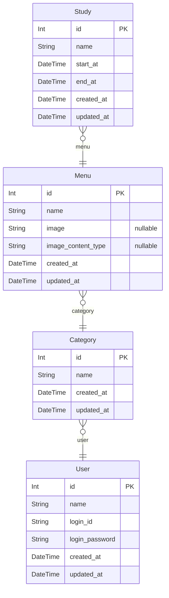

```mermaid
erDiagram

  User {
    Int id PK 
    String name  
    String login_id  
    String login_password  
    DateTime created_at  
    DateTime updated_at  
    }
  

  Category {
    Int id PK 
    String name  
    DateTime created_at  
    DateTime updated_at  
    }
  

  Menu {
    Int id PK 
    String name  
    String image  "nullable"
    String image_content_type  "nullable"
    DateTime created_at  
    DateTime updated_at  
    }
  

  Study {
    Int id PK 
    String name  
    DateTime start_at  
    DateTime end_at  
    DateTime created_at  
    DateTime updated_at  
    }
  
    Category o{--|| User : "user"
    Menu o{--|| Category : "category"
    Study o{--|| Menu : "menu"
```
